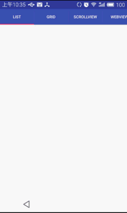

# RecyclerViewRefresh
对RecyclerView加入下拉刷新，上拉加载功能，运用了android5.0中的SwipeRefreshLayout来进行刷新功能。

使用时请注意：

1.禁用刷新使用setEnable（false）方法

2.禁用加载更多使用setLoadMoreEnable(false)方法

3.如果需要在ScrollView里嵌套RecyclerView，请使用ScrollViewLinearLayoutManager

4目前瀑布流RecyclerView加载更多有个Bug，第一加载loadview会在一个item中

请知悉
